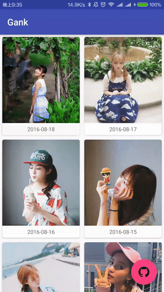

### Gank Android App

### 简介

项目整体使用MVP框架，主要参考 [MVP 模式在 GankDaily 中的应用](http://gudong.name/advanced/2015/11/23/gank_mvp_introduce.html) 和 [浅谈 MVP in Android](http://blog.csdn.net/lmj623565791/article/details/46596109)。

以 Activity 作为容器，Fragment 作为轻量级展示咨询内容和图片。

网络访问使用 [Retrofit](https://github.com/square/retrofit) 框架。妹纸图片的加载使用 [Fresco](http://fresco-cn.org/) 框架。保存图片主要使用 [RxAndroid](https://github.com/ReactiveX/RxAndroid) 对 IO 线程和 UI 线程交互。

首页对日报的概要信息进行懒加载，查看图片时支持手势缩放和拖拽。

沉浸式状态栏对 Android 4.4 以及 5.0 以上的版本做了适配。

### 依赖库

* [RxAndroid](https://github.com/ReactiveX/RxAndroid)
* [RxJava](https://github.com/ReactiveX/RxJava)
* [Retrofit](https://github.com/square/retrofit)
* [Fresco](http://fresco-cn.org/)

### 参考

* [Meizhi](https://github.com/drakeet/Meizhi)
* [GankDaily](https://github.com/maoruibin/GankDaily)
* [Fresco 保存图片到本地](http://www.jianshu.com/p/565e5b0ca823)
* More

### License

Licensed under the Apache License, Version 2.0 (the "License");
you may not use this file except in compliance with the License.
You may obtain a copy of the License at

http://www.apache.org/licenses/LICENSE-2.0

Unless required by applicable law or agreed to in writing, software
distributed under the License is distributed on an "AS IS" BASIS,
WITHOUT WARRANTIES OR CONDITIONS OF ANY KIND, either express or implied.
See the License for the specific language governing permissions and
limitations under the License.